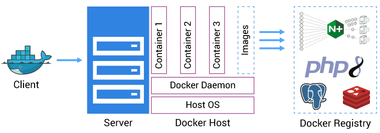

# Beedoo

O arquivo docker-compose.yml define a infraestrutura de contêineres que será usada para executar a aplicação.

Para executar a aplicação, utilize:
` /beedoo/public> docker-compose up -d

Para rodar os testes:
` /beedoo/public> composer install
` /beedoo/public> vendor/bin/phpunit tests/MessageControllersTest.php

Para testa, dexei um arquivo chamado (Insomnia_2023-05-04.json), é só importar no seu Insomnia
que tera toda estrura para realizar o request para API.

Por via das dúvidas segue o cURL:
`curl --request GET \
   --url 'http://localhost:8000/messages?page=1&search=exe'

`curl --request POST \
  --url http://localhost:8000/messages \
  --header 'Content-Type: application/json' \
  --data '{"message": "Esta é uma mensagem de exemplo."}'

Para a criação da API em questão, foram tomadas algumas decisões técnicas com o objetivo de garantir um código limpo, organizado e de fácil manutenção. A seguir, listamos algumas das principais escolhas feitas durante o desenvolvimento:

## Arquitetura
- Foi escolhida uma arquitetura em camadas, seguindo os princípios do padrão de arquitetura MVC (Model-View-Controller). A camada de modelo (Model) foi implementada utilizando o ORM Eloquent do framework Laravel, permitindo um acesso fácil e intuitivo ao banco de dados. A camada de controle (Controller) foi implementada utilizando o padrão PSR-7 para requisições HTTP, o que permite que a API seja consumida por diferentes clientes. A camada de visão (View) não foi utilizada, uma vez que a API não retorna HTML, mas sim JSON.

### Aqui estão algumas das decisões técnicas tomadas:

- Foi escolhido o servidor web Nginx porque ele pode ser configurado para fazer balanceamento de carga (load balancing) entre diversos servidores web, além de poder usá-lo como proxy reverso para o PHP. Pode-se definir um arquivo de configuração para o Nginx. Nesse arquivo, é possível configurar o proxy_pass para o servidor PHP, além de outras configurações relacionadas ao cache, segurança e performance.
- Foram definidos três serviços: db, php e web, cada um em seu próprio contêiner. O serviço db usa a imagem do Postgres mais recente como base. O serviço php usa um Dockerfile personalizado para construir uma imagem personalizada com as dependências do PHP necessárias para a aplicação.
- Foi utilizado o depends_on para garantir que os contêineres sejam iniciados na ordem correta, começando pelo serviço db.
- Foi definido um volume para persistir os dados do banco de dados, o que permite que os dados persistam mesmo que o contêiner seja excluído ou atualizado.
- Foi adicionado um serviço migrate para executar as migrações do banco de dados ao implantar a aplicação. O serviço usa o Phinx como ferramenta de migração do banco de dados.
- Foi definida uma variável de ambiente DATABASE_URL para especificar a URL do banco de dados, que é usada pela aplicação para se conectar ao banco de dados.
As portas 5432 e 8000 foram mapeadas do host para os contêineres db e web, respectivamente, para permitir que a aplicação seja acessada pelo navegador e para permitir a conexão com o banco de dados a partir de ferramentas externas.
- Foi utilizado o volumes para montar o diretório da aplicação no contêiner, permitindo que as mudanças no código sejam refletidas imediatamente na execução da aplicação.

### Bibliotecas
- Foram utilizadas as seguintes bibliotecas:

    - Phinx: é uma ferramenta de gerenciamento de banco de dados que permite a criação, migração e manipulação de esquemas de banco de dados de forma programática. Ele fornece uma interface fácil de usar para criar e gerenciar tabelas, colunas e chaves estrangeiras em um banco de dados.

    - Slim Framework: um microframework para PHP que permite a criação rápida e simples de APIs RESTful. Foi escolhido por sua simplicidade e facilidade de uso.

    - Illuminate Database: um pacote que oferece o ORM Eloquent para o framework Laravel. Foi escolhido por sua facilidade de uso e sua integração com o Slim Framework.

    - Carbon: uma biblioteca para manipulação de datas em PHP. Foi escolhida por sua simplicidade e por ser amplamente utilizada na comunidade PHP.

    - PHPUnit: um framework para testes automatizados em PHP. Foi escolhido por ser um dos mais populares na comunidade PHP e por oferecer uma ampla variedade de recursos para testes.

### Justificativas
A escolha da arquitetura em camadas foi feita com o objetivo de separar as responsabilidades do sistema, garantindo maior organização e facilidade de manutenção. O uso do ORM Eloquent permitiu acesso simplificado ao banco de dados, evitando a escrita manual de queries SQL. A escolha do Slim Framework foi feita por sua simplicidade e facilidade de uso, permitindo a criação rápida e eficiente da API. A utilização da biblioteca Carbon permitiu manipulação simples e eficiente de datas, evitando a necessidade de escrever código complexo para esse fim. A escolha do PHPUnit foi feita por ser uma das ferramentas mais populares na comunidade PHP para testes automatizados, permitindo a criação de testes robustos para garantir a qualidade do código.

### Análise de requisitos e planejamento técnico
- Nova funcionalidade: Adicionar comentários às mensagens

- Para adicionar a funcionalidade de permitir que os usuários adicionem comentários às mensagens, algumas etapas devem ser seguidas:

    - Implementar o Sentry para monitorar erros que possam ocorrer durante as requisições.
    - Montar um monitoramento para o banco de dados, para visualizar gargalos e melhorias necessárias.
    - Criar e utilizar banco de leitura, melhorando a performance da consulta de dados.
    - Implementar cache, para diminuir o tempo de cada requisição e poupar o banco.
    - Adicionar um novo modelo no Laravel chamado Comment com os campos necessários (por exemplo, message_id, user_id, content, created_at).
    - Adicionar a relação no modelo Message para permitir que uma mensagem tenha vários comentários (por exemplo, hasMany('App\Models\Comment')).
    - Criar uma nova rota para permitir que os usuários postem comentários em uma mensagem existente.
    - Criar uma nova rota para exibir todos os comentários de uma mensagem.
    - Adicionar validação nos campos de entrada de comentários (por exemplo, conteúdo não pode estar vazio e tamanho máximo de caracteres).
    - Adicionar autenticação e autorização para que apenas usuários autenticados possam postar comentários e que apenas o criador de um comentário possa editá-lo ou excluí-lo.

### Possíveis desafios técnicos:

- Implementação da autenticação e autorização: pode ser um desafio garantir que apenas usuários autenticados possam postar comentários e que apenas o criador de um comentário possa editá-lo ou excluí-lo. Isso pode envolver a implementação de um sistema de autorização baseado em funções ou permissões.
- Escalabilidade: à medida que o número de comentários e mensagens cresce, o desempenho do aplicativo pode ser afetado. Uma possível solução seria implementar um cache ou banco de dados distribuído para lidar com o grande volume de dados.

### Perguntas para o Product Owner:

- Quais campos devem ser incluídos em um comentário? Além do conteúdo, devemos incluir informações como a data em que foi postado e o autor do comentário?
- Qual é a política de privacidade em relação aos comentários? Eles devem ser visíveis para todos os usuários ou apenas para o autor da mensagem?
- Como deve ser feita a autenticação e autorização? Os usuários devem ser capazes de fazer login com um nome de usuário e senha ou por meio de uma conta existente em outro serviço (como Google ou Facebook)?
- Existe alguma restrição quanto ao número de comentários que um usuário pode fazer em uma mensagem?

### Autoavaliação:

- Possíveis melhorias com mais tempo:
    - Implementar testes automatizados para garantir que as novas funcionalidades e as funcionalidades existentes funcionem corretamente.
    - Melhorar a interface do usuário para tornar a navegação e a interação mais fáceis.
    - Adicionar recursos de pesquisa avançados para permitir que os usuários encontrem mensagens e comentários com mais facilidade.
    - Implementar a capacidade de os usuários denunciarem mensagens ou comentários inapropriados.
    - Melhorar a segurança do aplicativo, por exemplo, implementando medidas de proteção contra ataques de injeção SQL ou XSS.

### Escalabilidade

- Para lidar com um grande volume de acessos e dados, é necessário considerar a escalabilidade do projeto. Algumas possíveis melhorias a serem implementadas para garantir a escalabilidade do sistema são:

    - Utilização de um serviço de cache: Um serviço de cache pode ser usado para armazenar informações frequentemente acessadas em um cache de memória. Isso pode melhorar significativamente o tempo de resposta e a performance do sistema, pois reduz o número de solicitações feitas ao banco de dados.
    - Banco de leitura: Os bancos de leitura são geralmente mais simples e mais eficientes do que os bancos de dados transacionais, uma vez que não precisam lidar com a complexidade das transações, locks e outras operações de escrita. Isso permite que os bancos de leitura sejam otimizados para consulta de dados, resultando em melhor desempenho e tempo de resposta mais rápido.
    - Configuração de um cluster de bancos de dados: Com o aumento do volume de dados, o sistema pode precisar de um cluster de bancos de dados para lidar com a demanda. Isso envolve a configuração de vários servidores de bancos de dados, que podem trabalhar juntos para distribuir a carga de trabalho.
    - Utilização de balanceadores de carga: Para lidar com um grande número de acessos, pode ser necessário distribuir o tráfego de entrada entre vários servidores de aplicação. Isso pode ser feito usando um balanceador de carga, que pode distribuir as solicitações de entrada de forma eficiente e equilibrada.
    - Otimização do código: Otimizar o código pode melhorar significativamente a performance do sistema. Isso pode incluir a utilização de técnicas como caching, armazenamento em cache de resultados de consulta, minimização de consultas desnecessárias, otimização de bancos de dados, entre outros.
    - Uso de tecnologias de nuvem: Outra opção é utilizar tecnologias de nuvem, como serviços de armazenamento e computação em nuvem, que permitem escalar facilmente o sistema de acordo com a demanda.

### Algumas perguntas que eu gostaria de fazer ao Product Owner para esclarecer as regras de negócio seriam:

- Qual o número estimado de usuários que o sistema deverá suportar?
- Qual o volume de mensagens e comentários que o sistema deve suportar?
- Qual o tempo máximo de resposta que o sistema deve ter?
- Há alguma restrição de orçamento para a implementação de melhorias de escalabilidade?
- Há algum requisito de disponibilidade do sistema?